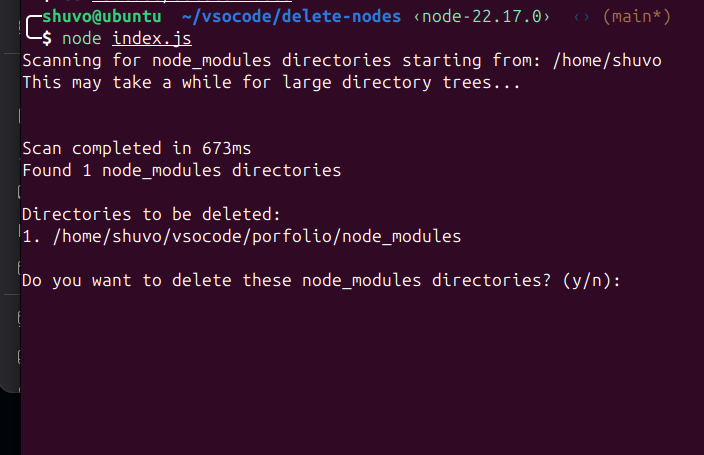

# Clean Node - Efficient Node Modules Cleanup Tool



A high-performance Node.js utility designed to efficiently find and delete `node_modules` directories across your system, helping you reclaim valuable disk space with minimal system impact.

## 🎯 What is Clean Node?

Clean Node is a command-line tool that scans your file system for `node_modules` directories and safely removes them. It's particularly useful for developers who work with multiple Node.js projects and want to free up disk space without manually hunting down each `node_modules` folder.

### Why Use Clean Node?

- **🚀 Fast & Efficient**: Uses async operations and smart filtering for optimal performance
- **💾 Disk Space Recovery**: Reclaim gigabytes of space from unused dependencies
- **🛡️ Safe & Smart**: Automatically skips system directories and provides confirmation prompts
- **📊 Detailed Reporting**: Shows exactly what was deleted and how much space was freed
- **⚡ Zero Dependencies**: Pure Node.js - no external dependencies required

## 🚀 Quick Start

### Installation & Usage

```bash
# Quick start - scan and delete node_modules automatically
npx delete-nodes -y

# Or with confirmation prompt
npx delete-nodes

# Scan from a specific directory
npx delete-nodes /path/to/your/projects -y
```

### Local Installation (Alternative)

```bash
# Clone the repository
git clone https://github.com/sarowarhosen03/clean-node.git
cd clean-node

# Make it executable
chmod +x index.js

# Run it
./index.js
```

## 📖 Detailed Usage Guide

### Command Line Options

```bash
npx delete-nodes [directory_path] [options]
```

**Arguments:**
- **`directory_path`** (optional): The starting directory to scan. Defaults to your home directory (`~`)

**Options:**
- **`-y, --yes`**: Automatically confirm deletion without prompting
- **`-h, --help`**: Show help information (coming soon)

**Examples:**
```bash
# Scan home directory with confirmation
npx delete-nodes

# Scan home directory and auto-delete
npx delete-nodes -y

# Scan specific directory with confirmation
npx delete-nodes ~/projects

# Scan specific directory and auto-delete
npx delete-nodes ~/projects -y
```

### Usage Examples

#### 1. Clean Your Entire Home Directory
```bash
# This will scan your entire home directory for node_modules
npx delete-nodes

# Auto-delete without confirmation
npx delete-nodes -y
```

#### 2. Clean Specific Project Directories
```bash
# Clean from your projects folder
npx delete-nodes ~/projects

# Clean from a specific project
npx delete-nodes ~/projects/my-app

# Clean from multiple locations (run multiple times)
npx delete-nodes ~/work-projects
npx delete-nodes ~/personal-projects

# Auto-delete from specific directories
npx delete-nodes ~/projects -y
```

#### 3. Test on a Small Directory First
```bash
# Test the tool on a small directory before running on your entire system
npx delete-nodes ~/test-directory

# Test with auto-delete
npx delete-nodes ~/test-directory -y
```

#### 4. Using npm Scripts (Local Installation)
```bash
# Standard usage
npm start

# Development/testing mode
npm run dev

# Test mode
npm test
```

## 🔧 How It Works

### Scanning Process

1. **Directory Traversal**: Recursively scans directories starting from the specified path
2. **Smart Filtering**: Automatically skips:
   - Hidden directories (starting with `.`)
   - System directories (`Desktop`, `Documents`, `Downloads`, etc.)
   - Version control directories (`.git`, `.svn`)
   - IDE directories (`.vscode`, `.idea`)
   - Already found `node_modules` directories
3. **Node Modules Detection**: Identifies directories named `node_modules`
4. **Path Collection**: Gathers all found `node_modules` paths

### Deletion Process

1. **Confirmation**: Shows all found directories and asks for user confirmation
2. **Progress Tracking**: Displays real-time progress during deletion
3. **Safe Deletion**: Uses `fs.rm()` with recursive and force options
4. **Error Handling**: Continues operation even if some deletions fail
5. **Reporting**: Shows final results including space freed

## ⚡ Performance Features

### Asynchronous Operations
- Uses `fs.promises` for non-blocking file system operations
- Allows other processes to run concurrently during scanning
- Prevents UI freezing during long operations

### Smart Directory Skipping
```javascript
// Automatically skips these directories
const SKIP_DIRS = new Set([
    'Desktop', 'Documents', 'Downloads', 'Music', 
    'Pictures', 'Public', 'Templates', 'Videos'
]);

// Skips these patterns
const IGNORE_PATTERNS = [
    /^\./,        // Hidden files/directories
    /^\.git$/,    // Git directory
    /^\.vscode$/, // VS Code settings
    /^\.idea$/,   // IntelliJ settings
];
```

### Node Modules Optimization
- **Stops scanning inside `node_modules`**: Once a `node_modules` directory is found, it's added to the deletion list and scanning stops inside it
- **Prevents infinite recursion**: Maximum depth limit prevents excessive recursion
- **Memory efficient**: Processes directories without storing everything in memory

## 📊 Output Examples

### Successful Scan and Deletion (with confirmation)
```
Scanning for node_modules directories starting from: /home/user
This may take a while for large directory trees...

Scan completed in 1250ms
Found 15 node_modules directories

Directories to be deleted:
1. /home/user/project1/node_modules
2. /home/user/project2/node_modules
3. /home/user/old-project/node_modules
4. /home/user/work/project-a/node_modules
5. /home/user/work/project-b/node_modules
...

Do you want to delete these node_modules directories? (y/n): y

Starting deletion process...
Deleting 15/15: old-project/node_modules

✅ Successfully deleted 15 node_modules directories
📦 Freed approximately 2.34 GB of disk space
⏱️  Deletion completed in 3200ms
```

### Auto-Confirmation Mode (-y flag)
```
Scanning for node_modules directories starting from: /home/user
⚠️  Auto-confirmation enabled (-y flag)
This may take a while for large directory trees...

Scan completed in 1250ms
Found 15 node_modules directories

Directories to be deleted:
1. /home/user/project1/node_modules
2. /home/user/project2/node_modules
3. /home/user/old-project/node_modules
...

✅ Auto-confirming deletion (use without -y flag for manual confirmation)

Starting deletion process...
Deleting 15/15: old-project/node_modules

✅ Successfully deleted 15 node_modules directories
📦 Freed approximately 2.34 GB of disk space
⏱️  Deletion completed in 3200ms
```

### No Node Modules Found
```
Scanning for node_modules directories starting from: /home/user
This may take a while for large directory trees...

Scan completed in 450ms
No node_modules directories found.
```

### Operation Cancelled
```
Found 8 node_modules directories

Directories to be deleted:
1. /home/user/project1/node_modules
2. /home/user/project2/node_modules
...

Do you want to delete these node_modules directories? (y/n): n
❌ Operation cancelled.
```

## 🛡️ Safety Features

### Confirmation System
- Always asks for user confirmation before deletion
- Shows exactly which directories will be deleted
- Allows cancellation at any time

### System Protection
- Automatically skips important system directories
- Handles permission errors gracefully
- Continues operation even if some directories fail

### Error Handling
```javascript
// Graceful error handling for common issues
try {
    await fs.rm(nodeModulesPath, { recursive: true, force: true });
} catch (error) {
    console.warn(`Warning: Could not delete ${nodeModulesPath}: ${error.message}`);
}
```

### Graceful Interruption
- Handles Ctrl+C (SIGINT) gracefully
- Provides clear feedback when interrupted
- Exits cleanly without leaving processes hanging

## 🔧 Development

### Project Structure
```
clean-node/
├── index.js          # Main application file
├── package.json      # Project configuration
└── README.md         # This documentation
```

### Available Scripts
```bash
# Start the application
npm start

# Run tests
npm test

# Development mode (test on specific directory)
npm run dev
```

### Requirements
- **Node.js**: >= 14.0.0
- **File System**: Read/write permissions for target directories
- **Operating System**: Linux, macOS, or Windows (with Node.js)

## 🚨 Important Notes

### Before Using
1. **Backup Important Data**: While the tool is safe, always ensure you can regenerate your dependencies
2. **Check Dependencies**: Make sure you have `package.json` files for projects you want to keep
3. **Test First**: Run on a small directory first to understand the behavior

### What Gets Deleted
- Only directories named exactly `node_modules`
- Only the `node_modules` directory itself (not the parent project)
- All contents within `node_modules` directories

### What's Protected
- Your source code and project files
- `package.json` and `package-lock.json` files
- System directories and hidden files
- Version control directories

## 🤝 Contributing

We welcome contributions! Here's how you can help:

### Development Setup
```bash
# Fork and clone the repository
git clone https://github.com/your-username/clean-node.git
cd clean-node

# Install dependencies (if any are added in the future)
npm install

# Make your changes
# Test thoroughly
npm test

# Submit a pull request
```

### Contribution Guidelines
1. **Fork the repository**
2. **Create a feature branch**: `git checkout -b feature/amazing-feature`
3. **Make your changes** and test thoroughly
4. **Commit your changes**: `git commit -m 'Add amazing feature'`
5. **Push to the branch**: `git push origin feature/amazing-feature`
6. **Open a Pull Request**

### Areas for Improvement
- Performance optimizations
- Additional filtering options
- GUI interface
- Integration with package managers
- Support for other dependency directories (vendor, lib, etc.)

## 📄 License

This project is licensed under the MIT License - see the [LICENSE](LICENSE) file for details.

## ⚠️ Disclaimer

**Use at your own risk!** This tool permanently deletes `node_modules` directories. While it's designed to be safe, always ensure you can regenerate your dependencies before using this tool. The authors are not responsible for any data loss.

## 📞 Support

If you encounter any issues or have questions:

1. **Check the documentation** above
2. **Search existing issues** on GitHub
3. **Create a new issue** with detailed information about your problem
4. **Include your operating system** and Node.js version

---

**Happy cleaning! 🧹✨**
